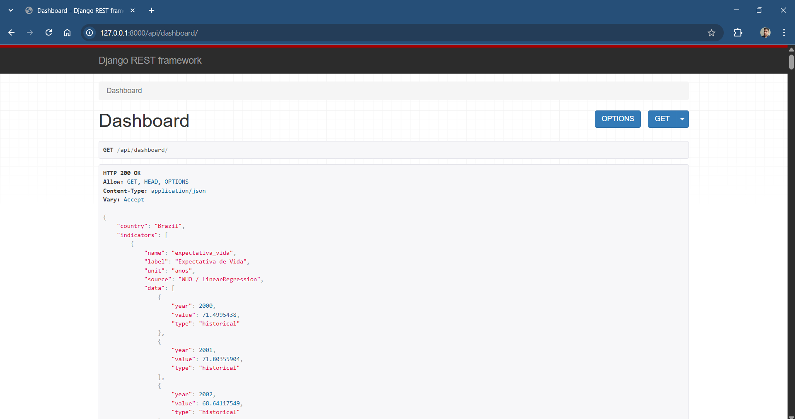

# Future Health Lens

Future Health Lens é uma API para análise e previsão de indicadores de saúde pública do Brasil.  
O projeto utiliza **Django**, **Django Rest Framework**, **scikit-learn** e integração com a **WHO API** para coletar, tratar e expor dados de saúde.

O objetivo é fornecer um conjunto de endpoints capazes de:

- Coletar dados reais da Organização Mundial da Saúde (OMS/WHO)
- Tratar e organizar indicadores de interesse da saúde pública brasileira
- Aplicar **Regressão Linear (scikit-learn)** para prever valores futuros
- Expor os dados já tratados e calculados através de uma API simples e acessível

---

## 📊 Indicadores Utilizados

Os dados são obtidos da WHO API, filtrados para o Brasil (código `BRA`).

Os indicadores disponíveis no sistema são:

```python
INDICATORS = {
    "expectativa_vida": "WHOSIS_000001",
    "mortalidade_infantil": "MDG_0000000001",
    "vacina_sarampo": "WHS9_86",
    "alcoolismo": "SA_0000001462",
    "tabagismo": "SA_0000001400",
}
```

Cada indicador é coletado diretamente da OMS, tratado e armazenado em estruturas internas para posterior exibição.

---

## 🚀 Tecnologias Utilizadas

- Python 3+

- Django

- Django Rest Framework (DRF)

- scikit-learn

- Requests (para consumo da WHO API)

- Pandas (para limpeza e manipulação dos dados)

- SQLite

---
## 🧠 Machine Learning

Para cada indicador, aplicamos um modelo de Regressão Linear para prever valores futuros com base nas séries históricas da OMS.

Pipeline resumido:

1. Coleta dos dados da WHO API

2. Limpeza e normalização

3. Conversão dos anos em valores numéricos

4. Treinamento do modelo de regressão

5. Geração da previsão (ex.: +5 anos)

---

## 📡 Endpoints
🔹 Dashboard Unificado

Retorna todos os indicadores tratados e suas previsões:

```bash
GET /api/dashboard
```
Resposta da API: 



## 📦 Instalação
```bash
git clone https://github.com/emanueljn/future-health-lens.git
cd future-health-lens
python -m venv venv
venv/Scripts/activate  # Windows
pip install -r requirements.txt
```

Execute as migrações:
```bash
python manage.py migrate
```

Inicie o servidor:
```bash
python manage.py runserver
```
---

## 🌍 Fonte dos Dados

Os dados são coletados diretamente da API oficial da OMS:

WHO GHO API
https://ghoapi.azureedge.net/api/

## 📁 Estrutura Simplificada do Projeto
```plaintext
futureHealthLens/
│
├── indicators/
│   ├── utils.py
│   ├── views.py
│   ├── models.py
│   ├── urls.py/
│   └── ...
│
├── FHL/
│   ├── settings.py
│   └── urls.py
│
└── manage.py
```
---

## 👨‍💻 Autor

Projeto desenvolvido para estudos e análise de dados de saúde pública pelos alunos do PI (Projeto Integrador) da UNIVESP em 2025.